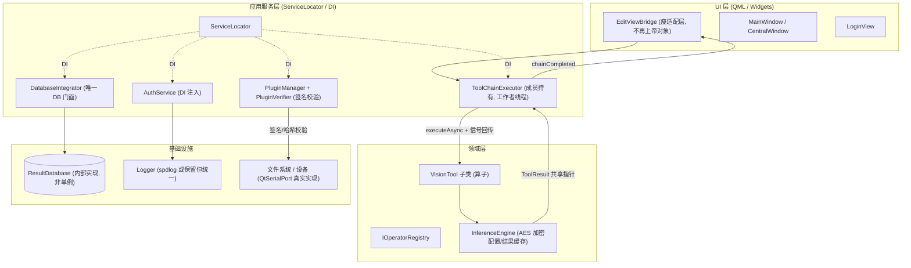
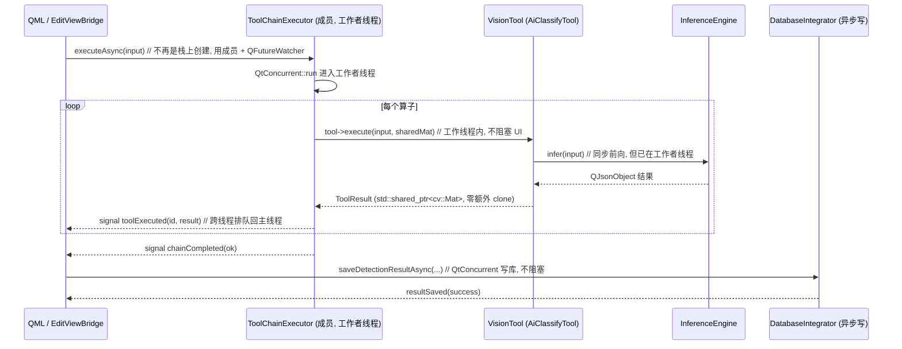

# QDV 工程架构 / 安全 / 可维护性 / 可扩展性 / 性能 评审报告

**评审人**：高见远（架构师）　**日期**：2026-07-06　**对象**：`E:\anchor\Trae\QDV`
**技术栈**：Qt6.8 / QML + C++17，CMake + MSVC，电芯视觉检测客户端

> 结论均带代码证据（文件:行）。所有 dossier 中标注"与背景描述不符"的项已**亲自抽样核实**，真伪见第 0 节。

---

## 0. 「与背景描述不符」核实结论（重点）

| 背景说法 | 核实结果 | 证据 |
|---|---|---|
| 已完成 `DatabaseManager` 单例 | **虚假**。源码中**不存在** `DatabaseManager` / `SchemeRepository` / `SchemeModel` 类 | `Grep class (DatabaseManager\|SchemeRepository\|SchemeModel)` → 0 命中；真实数据层为 `ResultDatabase` + `DatabaseIntegrator` 两个单例 |
| 采用 `AES-256-CBC` 加密 | **虚假**。实为**自研 XOR 流密码**，无完整性校验、无随机盐 | `src/Core/AuthService.cpp:378-392`（`plaintext ^ key ^ iv`，key=硬编码种子+机器ID），`:12` 硬编码种子 |
| 已实现 `resolveQtPluginPaths()` / PATH 注入防护 | **虚假**。项目源码中**不存在**该函数或任何 DLL 搜索路径硬化 | `Grep resolveQtPluginPaths\|AddDllDirectory\|SetDllDirectory` → 项目源码 0 命中（仅在 venv/build 噪声中） |
| 登录功能已实现 | **部分虚假**。代码完整保留，但编译期 `kLoginEnabled=false` 默认**关闭**，且可用环境变量 `QDV_FORCE_LOGIN` 切换 | `apps/SmartVision/main.cpp:73`、`:80-85` |
| （额外发现）依赖 `spdlog` 等 | **虚假/误导**。`cmake/Dependencies.cmake` 声明 `find_package(spdlog REQUIRED)` 等，但该文件**未被任何 CMakeLists 包含**（孤儿），实际 `Logger` 为自定义 Qt 文件日志 | `Grep "include(cmake/Dependencies"` in `CMakeLists.txt` → 0 命中；`include/Core/Logger.h` 无 `spdlog` 引用 |

**新增核实发现**：dossier 估算的"7 个单例"偏保守——`Grep ::instance()` 在 `src` 命中 30+ 处，`ResultDatabase`/`DatabaseIntegrator`/`AuthService`/`Logger`/`ModelManager`/`ToolFactory`/`PluginManager` 等确认为全局单例，且**不止 7 个**。

---

## 1. 各维度评分（1–10 / 等级）

| 维度 | 评分 | 等级 | 一句话评语 |
|---|---|---|---|
| 架构 | 6 | C+ | 分层清晰、扩展点设计良好，但上帝对象与"双 DB 单例"破坏内聚与单一职责 |
| **安全** | **2** | **F** | 硬编码密钥 + XOR 伪加密 + 登录可 bypass + DLL 无校验 + QML 调试敞开 + DB 明文，几乎全线失守 |
| 可维护性 | 5 | C− | 构建系统混乱、孤儿依赖清单、40+ 历史 `P1-` 注释残留，但文档量尚可 |
| 可扩展性 | 7 | B− | 算子 / 插件 / Scheme 三套扩展点清晰且数据驱动，仅设备端与训练推理为残桩 |
| 性能 | 5 | C | 同步推理阻塞主线程、`cv::Mat` 多次 clone、无 CI 回归；但已有 `QCache` 与异步序列化亮点 |

**总体判断**：安全是致命短板（F，必须 P0 处理）；性能因主线程阻塞存在明显可用性问题；架构与可扩展性中等偏上，是重构的安全基底。

---

## 2. 关键问题清单（证据 / 影响 / 改进 / 优先级 / 工作量）

### 2.1 安全（最薄弱）

**S1【P0】硬编码密钥种子 + XOR 流密码伪加密**
- 证据：`src/Core/AuthService.cpp:12`（`kAppSecretSeed="QDV_SecureStorage_2026_v1"`）、`:371-392`（`deriveEncryptionKey` 由硬编码种子+`machineUniqueId` 派生；`encryptForStorage` 用 `plaintext^key^iv` 循环异或，且 `:380` IV 仅 16 字节随机却与密文明文拼接存储）。
- 影响：密钥一半来自源码常量，任何拿到二进制的人都能还原 `deriveEncryptionKey`；XOR 流密码**不提供机密性对抗**（已知明文即可解出密钥流），且无完整性校验 → 可被静默篡改。背景所述"AES-256-CBC"不实。
- 改进（落地方案）：用 **AES-256-GCM**（带认证标签）。最小可行路径：引入 OpenSSL，`EVP_EncryptInit_ex(ctx, EVP_aes_256_gcm(), …)`；每条约 12 字节随机 IV + 16 字节 GCM tag；密钥由**用户口令经 PBKDF2/HKDF 派生**（不要再用机器 ID 当熵）。若不想引入 OpenSSL，可用 `libsodium` `crypto_secretbox` 或 header-only `QAESEncryption`（仅做 AES 时仍需自行补 HMAC/GCM）。
- 工作量：3–5 人日。

**S2【P0】登录默认关闭且可用环境变量 bypass**
- 证据：`apps/SmartVision/main.cpp:73`（`constexpr bool kLoginEnabled = false;`）、`:80-85`（`isLoginActive()` 允许 `QDV_FORCE_LOGIN=1/true/yes` 强制启用、`0/false/no` 强制禁用）。
- 影响：默认**完全无认证**；部署环境任意进程/用户设置该环境变量即可切换登录态，等于认证形同虚设。
- 改进：生产构建（Release / 带 `NDEBUG` 或 `QDV_SHIP` 宏）**默认开启**登录；移除环境变量 kill-switch（仅调试构建保留）；登录失败加限流与审计日志。`LoginView`/`AuthService` 代码已完整，恢复成本极低（文件顶部已有"恢复步骤"注释）。
- 工作量：1–2 人日。

**S3【P0】动态加载 DLL 无签名 / 哈希校验（RCE 风险）**
- 证据：`src/Plugins/PluginManager.cpp:49-90`（`loadPlugin` 仅 `QLibrary::load` + `resolve("createPlugin")`，无任何校验）；`apps/SmartVision/main.cpp:222-255`（`operators/*.dll` 直接 `loadPlugin`/`loadAndRegister`）。
- 影响：插件目录若被写入恶意 DLL（本地提权、中间人、U 盘），加载即**远程/本地代码执行**。
- 改进（落地方案）：加载前校验。两档可选——(a) **Authenticode 验签**：`WinVerifyTrust` 校验发布者证书；(b) **轻量方案**：构建期对每个插件算 SHA-256 并写入已签名的 `plugins.manifest`（含版本+哈希），加载时用**内嵌公钥**验签 manifest 再比对 DLL 哈希，不匹配则拒绝。建议在 `PluginVerifier`（已存在 `src/Plugins/PluginVerifier.cpp`）中落地。
- 工作量：3–5 人日。

**S4【P0】QML 调试器未禁用 + qml_debug 特性开启**
- 证据：`build/CMakeCache.txt:1160`（`QT_FEATURE_qml_debug:INTERNAL=ON`）；`Grep QT_QML_DEBUG|QML_DEBUG` in `src` → 0 命中（代码未关闭）。
- 影响：运行进程默认暴露 QML 调试端口，攻击者可附加**读取/修改 QML 对象状态、注入逻辑**。
- 改进：发布构建定义 `QT_NO_QML_DEBUGGER`（或确保 `qputenv("QT_QML_DEBUG","0")` 在 `main` 早期）；CMake 用 `option(QDV_ENABLE_QML_DEBUG)` 仅调试开启。
- 工作量：0.5 人日。

**S5【P1】SQLite 明文落盘**
- 证据：`src/Database/ResultDatabase.cpp:26-35`（`addDatabase("QSQLITE")` 后直接 `open`，无 `PRAGMA key` / SQLCipher）。
- 影响：检测结果含工艺/良率数据，明文库可被直接拷贝读取、篡改。
- 改进：引入 **SQLCipher**（`PRAGMA key = '…'`），或用加密卷 / 文件级加密；密钥由 S1 的密钥体系派生。
- 工作量：2–3 人日。

**S6【P2】路径无 `QDir::cleanPath` 防穿越**
- 证据：`Grep cleanPath` in `src` → 0 命中；外部路径（导入/导出/算子路径）未做规范化与白名单约束。
- 影响：用户可控路径可能 `../` 穿越写任意文件。
- 改进：所有外部路径经 `QDir::cleanPath` + 约束在允许根目录内。
- 工作量：1 人日。

**S7【P2】已引入 `QMessageAuthenticationCode` 但未用（并入 S1）**
- 证据：`src/Core/AuthService.cpp:6`（`#include <QMessageAuthenticationCode>`）但 `encryptForStorage` 路径未调用 HMAC。
- 影响：完整性工具齐备却不用。改进：在 S1 改造中一并接入 GCM tag / HMAC-SHA256。
- 工作量：0.5 人日（并入 S1）。

### 2.2 性能（阻塞链路）

**P1【P0】UI 入口同步调用 `executor.execute()` 阻塞主线程**
- 证据：`src/UI/EditViewBridge.cpp:1263` 与 `:1388` 在栈上创建 `::ToolChainExecutor executor;`；`:1311` 与 `:1444` `const bool ok = executor.execute(inputImage);` 同步执行。`ToolChainExecutor::execute` 自身在 `:35-37` 还会 `warn("called from main thread")`。
- 影响：单算子 / 方案执行期间 **UI 冻结、无进度反馈**，易触发"无响应"；栈上 executor 也使 `executeAsync()` 无法安全使用（QFuture 与对象会随函数返回被析构）。
- 改进（落地方案）：把 executor 提升为 **成员**（`QSharedPointer<ToolChainExecutor> m_executor`），调用 `executeAsync()` 并用 `QFutureWatcher<bool>` 持有 future；`execute()` 已通过 `toolExecuted` / `chainCompleted` 信号回传，跨线程信号自动排队到主线程，UI 直接更新。`executeAsync` 已存在（`:104-108`），无需新写，只需修调用点。
- 工作量：2–3 人日。

**P2【P1】`InferenceEngine::infer` 与 `AiClassifyTool` 同步推理**
- 证据：`src/AI/InferenceEngine.cpp:200`（`infer` 内 `:182-183 m_net.forward()` 同步前向）、`src/Vision/AiClassifyTool.cpp:92`（`m_engine->infer(...)` 同步）。推理经 `ToolChainExecutor::executeTool` → `tool->execute` 在调用线程执行。
- 影响：模型较大时推理耗时直接叠加在 P1 的主线程阻塞上，卡顿放大。
- 改进：在 `ToolChainExecutor::executeTool` 内用 `QtConcurrent::run` 将 `tool->execute` 派到工作者线程（与 P1 的 `executeAsync` 天然一致）；或给 `VisionTool` 增加 `executeAsync()` 返回 `QFuture<ToolResult>`。需确认各 `VisionTool` 的 `execute` 为**无共享可变状态**（当前看起来是一次性 `input→result`，线程安全）。
- 工作量：2–4 人日。

**P3【P1】`executeAsync` 按值捕获 `cv::Mat` 且 `execute()` 内多次 clone**
- 证据：`src/Vision/ToolChainExecutor.cpp:104-108`（`QtConcurrent::run([this, input]()…)` 按值捕获）、`:41`（`cv::Mat currentInput = input.clone();`）、`:79`（`currentInput = result.overlayImage.clone();`）。
- 影响：每次执行产生多份大图深拷贝，内存与带宽浪费。
- 改进：用 `std::shared_ptr<cv::Mat>` 或 move 语义传递；仅在确需独立副本处 clone；结果回传用共享指针零拷贝。
- 工作量：1–2 人日。

**P4【P2】ONNX Runtime 后端未集成，仅 OpenCV DNN fallback**
- 证据：`src/AI/InferenceEngine.cpp:193-198`（`runONNXRuntime` 直接 `return false` + warn fallback）。
- 影响：推理性能上限受 OpenCV DNN 限制，无法用 ORT/GPU 加速。
- 改进：启用 CMake 已有但未接通的 `ENABLE_ONNX_RUNTIME`（先修 M1 硬编码路径），接 ORT 并启用 GPU。
- 工作量：3–5 人日（并入 M1）。

**P5【P1】`TrainingInferenceView` 推理为 mock**
- 证据：`src/TrainingInference/TrainingInferenceView.cpp:893-930`（`QRandomGenerator` 生成 `confidence`/`category`，`:930 raw["_mock"]=true`，TODO(M7)）。
- 影响：训练/推理模块产出**非真实结果**，演示/验收易被误导；与"已完成训练推理"背景不符。
- 改进：接入真实 `InferenceEngine::infer`（TODO M7）；至少显式"演示模式"开关，避免默认伪装真实结果。
- 工作量：2–3 人日。

### 2.3 架构

**A1【P1】上帝对象 `EditViewBridge.cpp`（1735 行）**
- 证据：`wc -l src/UI/EditViewBridge.cpp` → **1735**；承担保存/加载/方案执行/单算子/图像处理/变量/ROI/Undo 等多职责（grep 见 `setTools`/`saveAsync`/`loadAsync`/变量/ROI 等混杂）。
- 影响：改动风险高、难单测、易合并冲突。
- 改进：按职责拆分为 `SchemeIO` / `SingleOperatorRunner` / `ImageProcessor` / `VariableBridge` / `ROIManager` / `UndoController`，`EditViewBridge` 仅做 QML 适配层（见第 3 节目标架构）。
- 工作量：5–8 人日（分阶段）。

**A2【P1】双 DB 单例职责重叠**
- 证据：`include/Database/DatabaseIntegrator.h`（单例，`:14 instance()`，内部 `:34 ResultDatabase* m_db`）；`include/Database/ResultDatabase.h`（同为单例，`:14 instance()` 公开，默认同路径 `./data/qdv_results.db`）。两者都对外暴露 `save/insert/query`。
- 影响：数据访问入口不唯一，事务/一致性难以保证，调用方可能混用两套 API。
- 改进：保留 `DatabaseIntegrator` 为**唯一门面**，将 `ResultDatabase` 降为内部实现（私有构造 + 友元），删除其公开 `instance()`。
- 工作量：2–3 人日。

**A3【P2】单例泛滥（≥7，实际更多）**
- 证据：`Grep ::instance()` 命中 30+ 处；命名单例含 `AuthService`/`Logger`/`ModelManager`/`ToolFactory`/`ResultDatabase`/`DatabaseIntegrator`/`PluginManager` 等。
- 影响：全局状态、单测困难、静态初始化顺序问题。
- 改进：引入 **ServiceLocator / DI 容器**，逐步收敛全局单例（先收 A2 的 DB 层）。
- 工作量：长线 5–10 人日。

**A4【P2】`SerialCommunicator` 存根（设备扩展残缺）**
- 证据：`src/Communication/SerialCommunicator.cpp:14-22`（`open()` 仅更新内部状态、打 warn、虚假 `emit connectionStatusChanged(true)`，未集成 `QtSerialPort`）。
- 影响：新设备（串口）扩展点残缺，连接状态不可信。
- 改进：接入 `QtSerialPort` 真实实现 + 超时/错误处理。
- 工作量：2–3 人日。

### 2.4 可维护性

**M1【P1】构建系统混乱 + 硬编码绝对路径**
- 证据：6 个构建目录（`build`/`build_D盘`/`build_mingw`/`build_new`/`build_new2`/`build_qt`）+ ~10 构建脚本；`CMakeLists.txt:14`（`D:/opencv`）、`:23`（`D:/opencv/build_mingw/bin`）、`:29-31`（fallback 仍 `D:/opencv/mingw_install`）、`:39`（`D:/onnxruntime-win-x64-1.17.0`）。
- 影响：不可移植、他人/CI 无法复现。
- 改进：路径改为 `CACHE` 默认空 + `find_package`；提供 `CMakePresets.json`；删除冗余构建脚本与过期 `CMakeLists.txt_D盘更新`。
- 工作量：3–5 人日。

**M2【P1】孤儿依赖清单 `cmake/Dependencies.cmake`**
- 证据：该文件 `find_package(spdlog 1.10 REQUIRED)`（`:23`）、`nlohmann_json`、`Catch2`、`CUDA`，但**未被任何 `CMakeLists.txt` 包含**（见第 0 节）；实际 `Logger` 为自定义 Qt 文件日志（`include/Core/Logger.h` 无 `spdlog`）。
- 影响：双份依赖源、死依赖、误导新人。
- 改进：删除该文件或收敛为唯一依赖入口；若确需 `spdlog`，则真正集成并替换自定义 `Logger`。
- 工作量：1–2 人日。

**M3【P2】40+ 历史 `P1-` 修复注释残留**
- 证据：`Grep "P1-"` 在 `src` 命中数十处（如 `EditViewBridge.cpp` 18 处、`ToolChainVerifier.cpp` 11、`MainWindow.cpp` 6、`ToolChainExecutor.cpp` 6 等）。
- 影响：生产代码噪声，掩盖真实逻辑。
- 改进：留痕迁移至 `CHANGELOG` / git commit，清理行内 `P1-X` 注释。
- 工作量：1–2 人日。

**M4【P0】无 CI**
- 证据：全局 `Glob {.github,.gitlab-ci.yml,Jenkinsfile,appveyor.yml,.circleci}` → 0 命中。
- 影响：无自动构建/测试/静态分析，回归无屏障，安全修复易回退。
- 改进：加 **GitHub Actions**（MSVC 构建 + Catch2 单测 + 静态扫描 clang-tidy），门禁 PR；优先于安全修复合入。
- 工作量：2–4 人日。

### 2.5 亮点（应保留 / 推广）

- `InferenceEngine` 结果缓存 `QCache`：`src/AI/InferenceEngine.cpp:357`（`m_inferenceCache.object(cacheKey)`）。
- 异步方案序列化：`src/UI/SchemeSerializer.cpp:129` / `:193`（`QtConcurrent::run` + `QFutureWatcher`）。
- 多处质量修复体现工程意识：空指针防御、数据竞争修复（`m_results.clear()` 移入锁内）、`failCount` 统计、常量时间比较（`AuthService.cpp:17-31`，虽保护的是错误算法，但意识可取）。

---

## 3. Mermaid 图

### 3.1 建议目标架构 / 模块依赖（收敛单例、拆分上帝对象、异步化）

### 3.2 关键调用链路：UI → 推理 → DB 应如何异步化（修复 P1/P2）

---

## 4. 优先级路线图

### P0 — 立即修复（安全失守 + 可用性阻塞，本迭代第 1 周）
| 编号 | 问题 | 工作量 |
|---|---|---|
| S1 | XOR → AES-256-GCM（真实加密 + 完整性） | 3–5 d |
| S2 | 登录默认开启 + 移除环境变量 bypass | 1–2 d |
| S3 | DLL 签名 / 哈希校验 | 3–5 d |
| S4 | 发布构建关闭 QML 调试器 | 0.5 d |
| P1 | UI 推理/方案执行改 `executeAsync` + 信号回传 | 2–3 d |
| M4 | 搭建 CI（build + catch2 + 静态扫描） | 2–4 d |

> P0 合计约 **12–20 人日**。安全 F 级与无 CI 必须同步起步，否则安全修复无回归屏障。

### P1 — 本迭代（质量与一致性）
| 编号 | 问题 | 工作量 |
|---|---|---|
| S5 | SQLite → SQLCipher 加密 | 2–3 d |
| P2 | 推理派发到工作者线程 | 2–4 d |
| P3 | `cv::Mat` 共享指针 / 减少 clone | 1–2 d |
| P5 | 训练推理去 mock（接真实 `Infer`） | 2–3 d |
| A1 | `EditViewBridge` 分阶段拆分（先做 IO/Runner 抽离） | 5–8 d（可拆期） |
| A2 | 双 DB 单例收敛为唯一门面 | 2–3 d |
| M1 | 构建系统清理 + 去硬编码路径 + Presets | 3–5 d |
| M2 | 删除孤儿 `Dependencies.cmake` / 统一依赖 | 1–2 d |

### P2 — 后续（健壮性 / 长线）
| 编号 | 问题 | 工作量 |
|---|---|---|
| S6 | 路径 `cleanPath` + 白名单 | 1 d |
| S7 | 接入 HMAC/GCM tag（并入 S1） | 0.5 d |
| P4 | 集成 ONNX Runtime + GPU | 3–5 d |
| A3 | 单例 → ServiceLocator/DI 收敛 | 5–10 d |
| A4 | `SerialCommunicator` 真实串口实现 | 2–3 d |
| M3 | 清理 `P1-` 历史注释残留 | 1–2 d |

---

## 5. 给团队的交付物索引
- 本报告：`docs/QDV架构安全评审_高见远.md`
- 关键证据文件（已抽样核实）：
  - `src/Core/AuthService.cpp`（:12, :371-392）
  - `apps/SmartVision/main.cpp`（:73, :80-85, :222-255）
  - `src/Plugins/PluginManager.cpp`（:49-90）
  - `src/Database/ResultDatabase.cpp`（:26-35）、`include/Database/{ResultDatabase,DatabaseIntegrator}.h`
  - `src/UI/EditViewBridge.cpp`（:1263, :1311, :1388, :1444）
  - `src/Vision/ToolChainExecutor.cpp`（:35-37, :41, :79, :104-108）
  - `src/AI/InferenceEngine.cpp`（:193-198, :200, :357）
  - `src/Vision/AiClassifyTool.cpp`（:92）
  - `src/TrainingInference/TrainingInferenceView.cpp`（:893-930）
  - `CMakeLists.txt`（:14, :23, :29-31, :39）、`cmake/Dependencies.cmake`（:23）
  - `build/CMakeCache.txt`（:1160）
