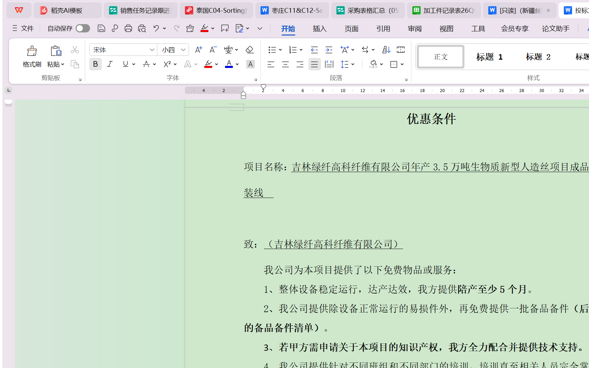
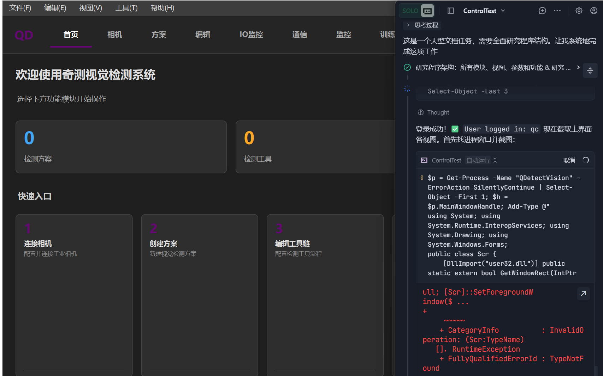

# QDetectVision（奇测视觉检测系统）使用说明书

> **版本**：v2.1.0  
> **文档更新日期**：2026-06-04  
> **适用产品**：奇测视觉检测系统（Q-DetectVision）

---

## 目录

1. [文档概述](#1-文档概述)
2. [程序简介](#2-程序简介)
3. [快速入门](#3-快速入门)
4. [界面详解](#4-界面详解)
5. [操作流程](#5-操作流程)
6. [模块介绍](#6-模块介绍)
7. [参数说明](#7-参数说明)
8. [常见问题](#8-常见问题)
9. [注意事项](#9-注意事项)

---

## 1. 文档概述

### 1.1 文档目的

本文档旨在为 **QDetectVision（奇测视觉检测系统）** 的用户提供完整的操作指南，帮助用户快速理解程序功能、掌握操作流程，并能够独立完成从安装部署到日常使用的全过程。

### 1.2 适用对象

| 对象 | 说明 |
|------|------|
| **产线操作员** | 日常检测任务执行、结果查看、异常报警处理 |
| **工艺工程师** | 检测方案制定、视觉工具链配置、参数调优 |
| **设备维护人员** | 相机连接配置、通信设置、IO 调试 |
| **系统管理员** | 用户账号管理、系统初始化配置 |

### 1.3 阅读建议

- **首次使用**：建议依次阅读第 1–4 章节，了解基本概念和界面布局
- **日常操作**：重点阅读第 5 章「操作流程」
- **高级配置**：参考第 6–7 章，了解各模块功能和参数详情
- **问题排查**：查阅第 8 章「常见问题」

---

## 2. 程序简介

### 2.1 功能概述

QDetectVision 是一款基于机器视觉的工业检测软件，提供完整的视觉检测解决方案，包括：

- **图像采集**：支持工业相机实时采集与图像载入
- **视觉检测工具链**：提供 13 种视觉检测工具，支持灵活编排检测流程
- **方案管理**：支持检测方案的创建、保存、加载和版本管理
- **结果输出**：支持 TCP/串口通信、IO 信号输出、FTP 上传
- **实时监控**：提供检测结果统计、异常报警和运行状态监控
- **AI 集成**：支持深度学习模型推理（ONNX Runtime）
- **AI 训练**：支持本地数据集标注 → 训练 → 导出 ONNX 的端到端流程（v2.1 新增）
- **用户管理**：支持多用户认证、权限控制和登录安全

### 2.2 运行环境要求

| 项目 | 最低要求 | 推荐配置 |
|------|----------|----------|
| **操作系统** | Windows 10（64位） | Windows 10/11（64位） |
| **处理器** | Intel Core i5 第8代 | Intel Core i7 第11代或更高 |
| **内存** | 8 GB | 16 GB 或更高 |
| **硬盘** | 2 GB 可用空间 | SSD 10 GB 可用空间 |
| **显卡** | 集成显卡 | NVIDIA GPU（CUDA 支持） |
| **运行时** | Qt 6.11.1、OpenCV 4.5.2 | — |
| **训练后端** | Python 3.11.9 + venv | — |

> **训练 Python 环境（v2.1+）**：`E:\anchor\Trae\QDV\training\venv`，已预装 `torch==2.1.2+cpu`、`torchvision==0.16.2+cpu`、`albumentations==1.3.1`、`onnx`、`onnxruntime`。**不要使用 Python 3.14**（PyTorch 不兼容）。

### 2.3 安装说明

1. 将程序文件夹 `QDetectVision` 复制到目标计算机
2. 确保已安装 [Visual C++ Redistributable](https://aka.ms/vs/17/release/vc_redist.x64.exe)（运行 VC_redist.x64.exe）
3. 进入 `bin` 目录，双击 `QDetectVision.exe` 启动程序
4. 首次启动将自动进入初始化设置向导

---

## 3. 快速入门

### 3.1 首次使用流程

```
启动程序 → 首次设置向导（创建管理员账号）→ 登录 → 创建检测方案 → 配置相机 → 添加检测工具 → 运行检测 → 查看结果
```

### 3.2 日常操作流程

```
启动程序 → 登录 → 加载已有方案 → 启动相机 → 执行检测 → 查看监控面板 → 导出结果
```

---

## 4. 界面详解

### 4.1 登录界面



登录界面是程序启动后显示的第一个界面，包含以下关键区域：

| 编号 | 区域名称 | 说明 |
|------|----------|------|
| ① | **程序标题栏** | 显示程序名称"奇测视觉检测系统 v1.0" |
| ② | **用户信息区域** | 显示当前登录用户的姓名和角色标识 |
| ③ | **用户名输入框** | 输入登录用户名 |
| ④ | **密码输入框** | 输入登录密码（支持回车键提交） |
| ⑤ | **登录按钮** | 点击或按回车键提交登录 |
| ⑥ | **锁定状态提示** | 密码多次错误后显示剩余锁定时间 |

**登录安全机制**：
- 连续 5 次登录失败后，账号将被锁定 15 分钟
- 锁定期间每次尝试会自动延迟（500ms→1s→2s→4s→8s）
- 程序自动记录所有登录尝试到日志文件

### 4.2 主界面（CentralWindow）



主界面登录成功后显示，采用左侧导航 + 右侧内容的经典布局：

| 编号 | 区域名称 | 说明 |
|------|----------|------|
| ① | **导航面板** | 左侧垂直导航栏，包含 8 个功能入口 |
| ② | **统计卡片区** | 顶部展示方案数、工具数、检测数、报警数 |
| ③ | **内容视图区** | 右侧主要内容区域，根据导航切换显示 |
| ④ | **状态栏** | 底部状态栏，显示运行状态和操作提示 |
| ⑤ | **退出/注销按钮** | 导航面板底部，返回登录界面 |

**导航面板按钮**（从上到下）：

| 按钮 | 对应视图 | 功能 |
|------|----------|------|
| 🏠 **首页** | Home 概览 | 快速操作入口与步骤引导 |
| 📷 **相机** | CameraView | 相机参数配置与实时图像预览 |
| 📋 **方案** | SchemeView | 检测方案管理与工具链编排 |
| ✏️ **编辑** | EditView | 视觉工具参数编辑与调优 |
| ⚙️ **IO** | IOView | IO 线路配置与信号测试 |
| 📡 **通信** | CommView | TCP/串口通信参数配置 |
| 📊 **监控** | MonitorView | 检测结果统计与实时状态 |
| 🤖 **AI** | TrainingInferenceView | AI 模型管理与推理 |

---

## 5. 操作流程

### 5.1 基础操作流程

#### 步骤 1：用户登录

1. 双击 `QDetectVision.exe` 启动程序
2. 在登录界面输入 **用户名** 和 **密码**
3. 点击「登录」按钮或按回车键
4. 登录成功后自动跳转至主界面

#### 步骤 2：创建检测方案

1. 点击左侧导航「方案」进入方案管理视图
2. 点击「新建方案」按钮
3. 输入方案名称，选择保存路径
4. 方案创建后自动进入编辑模式

#### 步骤 3：配置相机

1. 点击左侧导航「相机」进入相机配置视图
2. 设置相机 IP 地址
3. 配置图像参数：分辨率（默认 1920×1080）、曝光时间、增益
4. 选择触发模式（Software / Hardware）
5. 点击「连接」测试相机连接

#### 步骤 4：添加检测工具

1. 点击左侧导航「编辑」进入工具编辑视图
2. 从工具列表中选择需要的视觉检测工具
3. 按检测顺序拖拽排列工具执行顺序
4. 点击各工具进行参数配置
5. 保存方案

#### 步骤 5：运行检测

1. 确保相机已连接且方案已保存
2. 点击「开始检测」按钮
3. 监控视图实时更新检测结果
4. 异常情况自动报警

#### 步骤 6：查看结果

1. 点击左侧导航「监控」查看统计数据
2. 检测结果可通过通信模块输出到外部系统
3. 支持结果图像保存和导出

### 5.2 典型应用场景

#### 场景 A：零件尺寸检测

```
1. 新建方案 → 2. 配置相机（1920×1080, Mono8）→ 3. 添加工具链：
   图像预处理（降噪）→ 边缘检测 → 几何测量 → 轮廓分析
→ 4. 设置测量公差 → 5. 设置 IO 输出 OK/NG → 6. 开始检测
```

#### 场景 B：产品颜色分类

```
1. 新建方案 → 2. 配置相机 → 3. 添加工具链：
   颜色检测（设定 HSV 范围）→ 分支控制（按颜色分类）→ IO 输出
→ 4. 开始检测
```

#### 场景 C：标签定位与识别

```
1. 新建方案 → 2. 配置相机 → 3. 添加工具链：
   模板匹配（载入标签模板）→ 图像变换（仿射对齐）→ 阈值处理 → 轮廓分析
→ 4. 开始检测
```

---

## 6. 模块介绍

### 6.1 相机模块（CameraView）

**功能**：管理工业相机连接、配置采集参数、预览实时图像，支持图片导入模式作为相机替代方案。

**主要功能**：
- 相机 IP 地址配置与连接管理
- 图像分辨率设置（支持最大 1920×1080）
- 曝光时间与增益调节
- 触发模式选择（软件触发 / 硬件触发）
- 像素格式选择（Mono8 等）
- 实时图像预览窗口
- **图片导入模式**：当相机不可用时自动/手动切换
- **批量图片导入**：支持同时选择多张图片进行检测

#### 6.1.1 相机连接与自动回退

当系统检测到无法连接相机时，会自动弹出提示对话框，引导用户切换到图片导入模式。此功能确保在相机设备不可用的情况下，依然可以通过导入本地图片继续执行检测任务。

**操作流程**：
1. 点击「连接相机」按钮尝试连接
2. 若连接失败，系统弹出「相机连接失败」对话框
3. 选择「是」自动进入图片导入模式
4. 选择「否」保持当前状态，稍后可手动导入

#### 6.1.2 批量图片导入

支持一次性选择多张图片文件导入到系统中进行检测，无需逐张选择。

**操作步骤**：
1. 点击工具栏「导入图片」按钮
2. 在文件选择对话框中，按住 Ctrl 或 Shift 键多选图片文件
3. 支持的格式：PNG、JPG、JPEG、BMP、TIFF、WebP
4. 点击「打开」完成批量导入
5. 导入成功后显示第一张图片，并通过「上一张」/「下一张」按钮浏览
6. 当前显示位置和文件名会显示在图片区域的工具提示中

**导航控制**：
| 按钮 | 功能 |
|------|------|
| 上一张 | 切换到前一张图片（循环） |
| 下一张 | 切换到后一张图片（循环） |
| 拍照 | 保存当前显示的图片到本地 |

### 6.2 方案管理模块（SchemeView）

**功能**：创建、管理、导入/导出检测方案。

**主要功能**：
- 方案列表浏览与搜索
- 新建/复制/删除方案
- 方案 JSON 格式序列化存储
- 方案版本追踪（创建时间、修改时间）
- 方案导入/导出功能

**方案配置包含**：
- 相机参数配置
- 触发配置
- 输出通信配置
- 工具链定义
- 分支控制逻辑
- AI 模型绑定

### 6.3 编辑模块（EditView）

**功能**：可视化编排检测工具链，调整各工具参数，支持自定义工具的导入、修改和删除。

**支持的操作**：
- 从工具库拖拽添加工具到检测链
- 拖拽调整工具执行顺序
- 点击工具查看/编辑详细参数
- 删除工具、复制工具
- 分支节点添加与条件编辑
- **自定义工具管理**：导入、修改、删除自定义检测工具

#### 6.3.1 工具库分类

| 分类 | 包含工具 |
|------|----------|
| 输入 | 读图 |
| 预处理 | 图像预处理 |
| 特征提取 | 边缘检测、轮廓分析、斑点检测、线圆检测 |
| 分割 | 阈值分割 |
| 定位 | 模板匹配 |
| 检测 | 颜色检测 |
| 测量 | 几何测量 |
| 运算 | 图像运算 |
| 变换 | 图像变换 |
| 合并 | 图像合并 |
| 流程 | 分支控制 |
| AI | AI分类 |
| 自定义 | 用户导入的自定义工具 |

#### 6.3.2 自定义工具管理

自定义工具功能允许用户导入自己编写的检测工具定义，扩展系统内置工具库。自定义工具以 JSON 格式定义，包含工具名称、类型、描述和参数。

**导入自定义工具**

操作步骤：
1. 在编辑模块左侧面板的「自定义工具管理」区域，点击「导入自定义工具」
2. 系统弹出导入说明对话框，展示 JSON 定义格式和示例
3. 阅读说明后点击「确定」，在文件选择对话框中选择 `.json` 文件
4. 系统自动解析 JSON 文件，校验格式
5. 校验通过后工具添加到工具库的「自定义」分类中
6. 导入成功后会显示包含工具名称、类型和描述的确认信息

JSON 定义格式：
```json
{
  "name": "我的自定义检测",
  "type": "MyCustomTool",
  "description": "用于检测特定缺陷",
  "params": {
    "threshold": 128,
    "mode": "fast"
  }
}
```

字段说明：
| 字段 | 必需 | 说明 |
|------|------|------|
| `name` | 是 | 工具名称，在工具库中显示 |
| `type` | 是 | 工具类型标识，用于系统内部识别 |
| `description` | 否 | 工具功能描述 |
| `params` | 否 | 工具参数配置对象 |

错误处理：
- 文件无法打开 → 提示具体错误原因
- JSON 格式错误 → 提示错误位置和类型
- 缺少必需字段 → 提示缺少的字段名称
- 工具名重复 → 询问是否覆盖现有定义

**修改自定义工具**

操作步骤：
1. 点击「修改自定义工具」按钮
2. 在弹出的选择列表中选择要修改的工具
3. 系统打开 JSON 编辑器，显示当前工具定义
4. 在编辑器中修改 JSON 内容
5. 点击「保存」提交修改，系统校验 JSON 格式
6. 校验通过后更新工具定义并刷新工具库

注意事项：
- 修改工具名称时，新名称不能与已有工具重复
- JSON 格式错误时修改会被取消，原定义保持不变
- 编辑器使用等宽字体，方便查看 JSON 结构

**删除自定义工具**

操作步骤：
1. 点击「删除自定义工具」按钮
2. 在选择列表中选择要删除的工具
3. 系统弹出确认对话框，提示删除操作不可撤销
4. 确认后工具从库中移除

注意事项：
- 删除操作不可撤销，请谨慎操作
- 已添加到工具链中的自定义工具实例不受删除影响
- 删除前请确认该工具不再需要

#### 6.3.3 方案保存与加载（v2.1.0 M4 新增）

**功能**：将画布上的算子编排保存为 JSON 方案文件，便于跨会话复用、版本管理、跨设备共享。

**支持的操作**：

| 操作 | 触发方式 | 状态联动 |
|------|----------|----------|
| 新建空方案 | 顶栏「新建」按钮 | 自动清空 undo 栈 |
| 保存方案 | 顶栏「保存」按钮（仅在 `isDirty=true` 时可点） | 异步写入，2.5s 内 Toast 提示结果 |
| 加载方案 | 顶栏「加载」按钮 | 异步读取，替换当前画布 + 自动清空 undo 栈 |

**保存文件格式**（UTF-8 缩进 JSON）：

```json
{
  "version": "2.1.0",
  "schemeName": "AOI 工序 1",
  "savedAt": "2026-06-04T15:30:22",
  "nodes": [
    { "id": "...", "type": "ReadImage", "x": 100, "y": 200,
      "params": { "imagePath": "test.png", "loopMode": 0 } }
  ],
  "connections": [
    { "fromId": "...", "fromPort": "image", "toId": "...", "toPort": "image" }
  ]
}
```

**注意事项**：
- 保存/加载是**异步**操作（QtConcurrent + QFutureWatcher），大方案不会卡 UI
- 加载成功后撤销栈被清空（视为新方案基线）
- 加载失败时 Toast 红色错误提示，文件路径仍记录
- 当前方案名显示在顶栏「QDV · 方案名」；未保存的修改以「方案名 *」标记

#### 6.3.4 撤销与重做（v2.1.0 M4 新增）

**功能**：所有对画布的操作（添加节点、移动、删除、参数修改、连边）均支持撤销/重做，避免误操作丢失方案编排。

**支持的操作**：

| 触发方式 | 操作 | 说明 |
|----------|------|------|
| 顶栏「撤销」按钮 | 撤销上一次操作 | 栈空时按钮禁用 |
| 顶栏「重做」按钮 | 重做已撤销的操作 | 栈空时按钮禁用 |
| `Ctrl+Z` | 撤销 | 编辑器焦点时全局生效 |
| `Ctrl+Y` | 重做 | 编辑器焦点时全局生效 |

**技术细节**：
- 基于 Qt Undo Framework（QUndoStack + QUndoCommand）
- 默认上限 **50 步**（超限自动丢弃最早记录）
- 同一参数的连续修改（如拖动滑块）会自动合并为 1 步
- 多参数批量修改（如「应用」详编）打包为 1 步（macro command）
- 加载新方案后撤销栈被清空（视为基线重置）

**6 种 UndoCommand**（v2.1.0 M4.06 实现）：

| 命令 | 触发场景 | 是否可合并 |
|------|----------|------------|
| AddNodeCommand | 双击工具库添加节点 | 否 |
| RemoveNodeCommand | 删除节点 | 否 |
| MoveNodeCommand | 拖动节点 | **是**（连续移动合并） |
| ConnectNodesCommand | 拖线连接 | 否 |
| DisconnectNodesCommand | 删除连线 | 否 |
| PropertyChangeCommand | 参数面板修改 | **是**（连续编辑合并） |

**注意事项**：
- 撤销/重做仅作用于**当前会话**；保存/加载后会重置基线
- 与 Core/SchemeManager 推理协同：M5+ 阶段将通过 `schemeContext` 指针接入 Scheme 业务对象

#### 6.4 IO 模块（IOView）

**功能**：配置数字 IO 线路，控制外部设备信号。

**主要功能**：
- 最多支持 8 路 IO 线路
- 每路可配置为输入模式、输出模式或脉冲输出
- 实时输入状态监控
- 脉冲输出控制（可指定脉宽）
- 触发信号检测与响应

### 6.5 通信模块（CommView）

**功能**：配置与外部系统的数据通信。

#### 6.5.1 TCP 通信

| 参数 | 默认值 | 说明 |
|------|--------|------|
| 主机地址 | — | 目标服务器 IP 或域名 |
| 端口号 | 5000 | TCP 端口 |
| 数据格式 | JSON | 传输数据格式 |
| 缓冲区上限 | 10 MB | 防止内存溢出的保护阈值 |

#### 6.5.2 串口通信

| 参数 | 默认值 | 可选值 |
|------|--------|--------|
| 端口名称 | — | COM1, COM2, ... |
| 波特率 | 115200 | 9600 / 19200 / 38400 / 57600 / 115200 |
| 数据位 | 8 | 5 / 6 / 7 / 8 |
| 停止位 | 1 | 1 / 2 |
| 校验位 | 无 | 无 / 偶校验 / 奇校验 |

#### 6.5.3 FTP 输出

支持将检测结果图像自动上传至 FTP 服务器。

### 6.6 监控模块（MonitorView）

**功能**：实时展示检测运行状态和结果统计。

**显示内容**：
- 检测总数 / 合格数 / 不合格数
- 实时检测效率（次/分钟）
- 各工具执行耗时统计
- 异常报警列表
- 检测日志实时滚动

### 6.7 AI 模块（TrainingInferenceView）

**功能**：管理深度学习模型，执行 AI 推理检测，支持数据集管理与图像分类标注。

**主要功能**：
- 模型文件导入与注册
- ONNX Runtime 推理引擎配置
- 模型输入/输出张量配置
- 推理结果可视化
- 模型性能监控
- **图像列表多选**：每个图像项带复选框，支持单个/批量选择
- **全选/反选功能**：快速选择操作
- **类别管理**：每个类别带"加入"按钮，支持批量标注
- **默认 YOLO 模型**：自动选中 YOLO 模型，开箱即用

#### 6.7.1 图像列表多选功能

每个图像项左侧都有独立复选框，支持：
- 单个选择/取消选择
- 全选/取消全选
- 反选（选中未选的，取消已选的）
- Ctrl 键多选不连续的图像
- Shift 键多选连续的图像

**操作步骤**：
1. 点击图像左侧复选框进行单个选择
2. 点击「全选」按钮选择所有图像
3. 点击「反选」按钮反转选择状态
4. 选择完成后可进行批量删除或添加到类别

#### 6.7.2 类别管理功能

每个类别名称右侧都有「加入」按钮：
- 按钮状态：无图片选中时为灰色（不可点击），有图片选中时为蓝色（可点击）
- 点击「加入」按钮将选中的图片批量添加到对应类别
- 提供操作成功/失败的视觉反馈

**操作步骤**：
1. 在图像列表中使用复选框选择要添加的图片
2. 在类别列表中找到目标类别
3. 点击该类别右侧的「加入」按钮
4. 确认添加完成

#### 6.7.3 模型选择功能

模型选择下拉菜单默认选中 YOLO 模型：
- 可用模型列表：yolov5s、resnet50、defect_detector
- 默认选中：yolov5s（YOLO 目标检测模型）
- 刷新页面或重新加载模块时保持 YOLO 选中状态
- 智能匹配：优先查找"YOLO"，其次查找包含"yolo"的模型

**操作步骤**：
1. 打开训练推理模块（默认已选择 YOLO 模型）
2. 如需切换其他模型，点击下拉菜单选择
3. 选择后模型信息自动更新显示

**详细说明**：请参考《训练推理模块新功能使用说明书》

#### 6.7.4 本地训练流程（v2.1 新增）

训练推理模块已集成**本地端到端训练**：用户在 UI 标注图像 → 选择模型与超参数 → 启动训练 → 训练完成自动导出 ONNX 并注册到模型库。

**训练流程**：
```
图像导入 → 多选标注（按类别「加入」）→ 选择模型/超参 → 启动训练
   ↓
[TrainingBridge 启动 Python 子进程] → [JSON Lines 进度回传]
   ↓
训练完成 → 导出 ONNX + labels.json → ModelManager::registerTrainedModel
   ↓
模型出现在模型下拉列表中，可立即用于推理
```

**核心组件**：
| 组件 | 路径 | 作用 |
|------|------|------|
| `QDV::TrainingBridge` | `include/AI/TrainingBridge.h` | C++ 端：QProcess 启动 Python、解析 JSON Lines 进度 |
| `training/train.py` | Python 训练入口 | 加载 manifest → DataLoader → Trainer → ONNX 导出 |
| `training/engine/trainer.py` | PyTorch 训练器 | Adam + ReduceLROnPlateau + 早停 + AMP |
| `training/data/dataset.py` | Manifest 数据集 | `np.fromfile + cv2.imdecode` 兼容中文路径 |
| `ModelManager::registerTrainedModel` | 模型自动注册 | 复制到 `models/`、更新 `manifest.json`、命名冲突加时间戳 |

**可配置超参数**：

| 参数 | 默认值 | 取值范围 | 说明 |
|------|--------|----------|------|
| `modelType` | `resnet18` | `resnet18` / `resnet50` / `efficientnet_b0` / `mobilenet_v3_small` / `feature_svm` | 训练模型 |
| `numEpochs` | 30 | 1–500 | 训练轮数 |
| `batchSize` | 8 | 1–64 | 批大小（**必须 ≤ 训练样本数**） |
| `learningRate` | 0.001 | 1e-5 – 1.0 | 学习率 |
| `imageSize` | 224 | 64–512 | 训练输入尺寸 |

**进度信号（JSON Lines 协议）**：
```json
{"type": "progress", "epoch": 5, "total_epochs": 30, "train_loss": 0.12, "train_acc": 0.96, "val_loss": 0.18, "val_acc": 0.94, "elapsed_sec": 42.1}
{"type": "log", "phase": "early_stop", "message": "..."}
{"type": "complete", "success": true, "onnx_path": "...", "labels_path": "...", "total_time_sec": 312.5, "metrics": {"best_val_acc": 0.95, "best_epoch": 18, ...}}
{"type": "error", "phase": "data", "message": "..."}
```

**心跳监控与故障定位**：
- TrainingBridge 每 5s 检查一次：若 30s 内无任何输出，判定为卡死
  - **未收到任何输出**（导入阶段卡死）：提示 import torch / CUDA 初始化问题
  - **曾收到输出后停止**（训练阶段卡死）：提示训练循环卡死
- 强制 `kill()` 终止 Python 进程，并 emit `trainingError`

**使用步骤**：
1. 打开「训练推理」模块
2. 点击「导入图像」/「导入文件夹」加载训练样本
3. 在「类别」面板创建类别（如「OK」「NG」），用「加入」按钮将选中图像批量归类
4. 在「推理」面板选择模型（如 `resnet18`）、设置超参
5. 点击「开始训练」→ 弹出训练进度对话框，实时显示 Epoch/Acc
6. 训练完成后模型自动出现在「模型选择」下拉中
7. 可立即选中该模型对测试图像进行推理

**注意事项**：
- ⚠️ `batch_size` 必须 ≤ 训练样本数；过小时 `drop_last=True` 会导致训练集为空
- ⚠️ 训练路径（manifest 中的 `path`）支持中文（C++ 写 BOM + Python 读 `utf-8-sig` + OpenCV 用 `np.fromfile` 兼容）
- ⚠️ 不要修改 `training/venv/`；如需重装请参考 `training/requirements.txt`
- ⚠️ albumentations 必须 ≤ 1.3.x；1.4+ 需 albucore（不可用）

### 6.8 AI分类工具（AiClassify）

**功能**：在工具链中集成 AI 图像分类推理，利用深度学习模型对图像进行自动分类检测。

**核心特性**：
- 支持 ONNX 格式模型加载
- 可配置置信度阈值，低于阈值自动判为不合格
- 支持 Top-K 分类结果输出
- 自动模型预热（Warm Up）加速首次推理
- 完整的模型加载、推理、卸载生命周期管理
- 详细的推理性能指标输出

#### 6.8.1 使用方式

AI分类工具作为工具链中的一个节点使用，与其他内置工具完全兼容：

1. 在编辑模块的工具库中找到「AI」分类
2. 双击「AI分类」工具将其添加到工具链中
3. 选中工具链中的 AI分类 节点
4. 在属性面板中配置以下参数

#### 6.8.2 配置参数

| 参数 | 默认值 | 说明 |
|------|--------|------|
| `modelPath` | — | ONNX 模型文件路径（必需） |
| `confidenceThreshold` | 0.5 | 置信度阈值（0.0–1.0），低于此值判定为不合格 |
| `topK` | 3 | 返回置信度最高的 K 个分类结果 |
| `inputWidth` | 224 | 模型输入图像宽度（像素） |
| `inputHeight` | 224 | 模型输入图像高度（像素） |
| `categoryLabels` | — | 分类标签名称列表，与模型输出索引对应 |

#### 6.8.3 推理流程

```
输入图像 → 预处理(缩放+归一化) → ONNX推理 → Softmax → Top-K筛选 → 阈值判定 → 输出结果
```

**预处理步骤**：
1. 图像缩放至指定输入尺寸（默认 224×224）
2. 像素值归一化（均值 [0.485, 0.456, 0.406]，标准差 [1/255]）
3. 转换为模型输入张量格式

**输出结果字段**：
| 字段 | 类型 | 说明 |
|------|------|------|
| `category` | string | 分类结果标签 |
| `category_name` | string | 映射后的分类名称（需配置 categoryLabels） |
| `class_index` | int | 分类索引 |
| `confidence` | double | 置信度（0.0–1.0） |
| `pass` | bool | 是否通过（置信度 ≥ 阈值） |
| `preprocess_ms` | double | 预处理耗时（毫秒） |
| `inference_ms` | double | 推理耗时（毫秒） |
| `postprocess_ms` | double | 后处理耗时（毫秒） |
| `backend` | string | 推理后端（DNN/ONNX Runtime） |

#### 6.8.4 模型准备

系统支持 ONNX 格式的分类模型，推荐使用以下方式准备模型：

1. 使用 PyTorch/TensorFlow 训练图像分类模型
2. 导出为 ONNX 格式
3. 确保模型输入尺寸与配置的 `inputWidth`/`inputHeight` 匹配
4. 将模型文件放置在项目可访问的目录中
5. 在工具属性中配置 `modelPath` 指向模型文件

#### 6.8.5 性能优化

- **模型预热**：工具首次加载模型时自动执行 3 次预热推理，消除首次推理延迟
- **置信度阈值**：合理设置阈值可以平衡检测精度和通过率
- **输入尺寸**：较小的输入尺寸可提升推理速度，但可能降低精度
- **Top-K**：仅返回最可能的 K 个分类结果，减少不必要的计算

#### 6.8.6 使用示例

**场景：产品缺陷分类检测**

```
配置：
  modelPath: "models/defect_classifier.onnx"
  confidenceThreshold: 0.85
  topK: 2
  inputWidth: 224
  inputHeight: 224
  categoryLabels: ["正常", "划痕", "裂纹", "污渍", "变形"]

检测流程：
  1. 相机采集图像 → 2. 图像预处理 → 3. AI分类 → 4. 结果判定
```

若模型输出类别 1 的置信度为 0.92，则：
- 分类结果：划痕
- 判定：合格（0.92 ≥ 0.85）
- 输出 top-2：[划痕(0.92), 正常(0.05)]

### 6.9 读图工具（ReadImage）

**功能**：基于 Halcon `read_image` 算子核心功能设计，用于从本地文件系统中读取图像文件，作为工具链的数据输入源。

**核心特性**：
- 支持多种常见图像格式（PNG、JPG、JPEG、BMP、TIFF、WebP、PBM、PGM、PPM）
- 可配置色彩模式（彩色、灰度、原始模式）
- 自动校验文件存在性和可读性
- 详细的图像元数据输出（尺寸、通道数、位深等）
- 文件大小与格式信息记录

#### 6.9.1 使用方式

1. 在编辑模块的工具库中找到「输入」分类
2. 双击「读图」工具将其添加到工具链中，通常作为工具链的第一个节点
3. 选中工具链中的读图节点
4. 在属性面板中配置 `filePath` 指向目标图像文件路径

#### 6.9.2 色彩模式

| 模式值 | 模式名称 | 说明 |
|--------|----------|------|
| `0` | 原始格式 | 保留图像原始通道格式（含 alpha） |
| `1` | 灰度模式 | 强制转换为单通道灰度图 |
| `2` | 彩色模式 | 强制转换为三通道 BGR 彩色图（默认） |

#### 6.9.3 输出结果字段

| 字段 | 类型 | 说明 |
|------|------|------|
| `filePath` | string | 图像文件完整路径 |
| `fileName` | string | 文件名（不含路径） |
| `fileSize` | int | 文件大小（字节） |
| `width` | int | 图像宽度（像素） |
| `height` | int | 图像高度（像素） |
| `channels` | int | 通道数 |
| `depth` | int | 像素位深 |
| `colorMode` | int | 当前色彩模式 |
| `colorModeDesc` | string | 色彩模式描述 |

#### 6.9.4 错误处理

| 错误场景 | 处理方式 |
|----------|----------|
| 文件路径未配置 | 返回错误 "No file path configured" |
| 文件不存在 | 返回错误 "File not found: {path}" |
| 文件不可读 | 返回错误 "File not readable: {path}" |
| 文件解码失败 | 返回错误 "Failed to decode image"，附带可能原因提示 |
| 非标准格式 | 输出警告但继续尝试读取 |

---

## 7. 参数说明

### 7.1 相机参数（CameraConfig）

| 参数名称 | 默认值 | 取值范围 | 说明 |
|----------|--------|----------|------|
| `ip` | — | 有效 IPv4 地址 | 相机 IP 地址 |
| `exposure` | 5000 | 1–1000000（μs） | 曝光时间（微秒） |
| `gain` | 1.0 | 0.0–32.0 | 增益倍数 |
| `triggerMode` | "Software" | "Software" / "Hardware" | 触发模式 |
| `width` | 1920 | 640–4096 | 图像宽度（像素） |
| `height` | 1080 | 480–3072 | 图像高度（像素） |
| `pixelFormat` | "Mono8" | "Mono8" / "RGB8" 等 | 像素格式 |

### 7.2 触发参数（TriggerConfig）

| 参数名称 | 默认值 | 取值范围 | 说明 |
|----------|--------|----------|------|
| `mode` | "Software" | "Software" / "Hardware" | 触发来源 |
| `delay` | 0 | 0–10000（ms） | 触发延迟 |
| `pulseWidth` | 100 | 1–10000（ms） | 脉冲宽度 |
| `debounce` | false | true / false | 是否启用去抖 |
| `debounceTime` | 10 | 1–1000（ms） | 去抖时间 |

### 7.3 输出参数（OutputConfig）

| 参数名称 | 默认值 | 取值范围 | 说明 |
|----------|--------|----------|------|
| `tcp.host` | — | 有效地址 | TCP 目标主机 |
| `tcp.port` | 5000 | 1–65535 | TCP 端口 |
| `tcp.format` | "json" | "json" / "binary" | 数据格式 |
| `io.line0`–`line3` | — | "input"/"output"/"pulse" | IO 线路模式 |
| `ftpEnabled` | false | true / false | 启用 FTP |
| `ftpHost` | — | 有效地址 | FTP 服务器地址 |
| `ftpPath` | — | 有效路径 | FTP 上传路径 |

### 7.4 视觉检测工具参数

#### 7.4.1 模板匹配（TemplateMatch）

| 参数 | 默认值 | 说明 |
|------|--------|------|
| `templatePath` | — | 模板图像文件路径 |
| `threshold` | 0.8 | 匹配阈值（0.0–1.0） |
| `matchMethod` | "SQDIFF" | 匹配算法 |

#### 7.4.2 边缘检测（EdgeDetect）

| 参数 | 默认值 | 说明 |
|------|--------|------|
| `lowThreshold` | 50 | Canny 低阈值（0–255） |
| `highThreshold` | 150 | Canny 高阈值（0–255） |
| `apertureSize` | 3 | Sobel 算子尺寸（3/5/7） |

#### 7.4.3 Blob 检测（BlobDetect）

| 参数 | 默认值 | 说明 |
|------|--------|------|
| `minArea` | 10 | 最小面积（像素²） |
| `maxArea` | 1000 | 最大面积（像素²） |
| `minCircularity` | 0.8 | 最小圆度（0.0–1.0） |
| `maxCircularity` | 1.0 | 最大圆度（0.0–1.0） |

#### 7.4.4 颜色检测（ColorDetect）

| 参数 | 默认值 | 说明 |
|------|--------|------|
| `hMin` / `hMax` | 0 / 180 | 色相范围（0–180） |
| `sMin` / `sMax` | 0 / 255 | 饱和度范围（0–255） |
| `vMin` / `vMax` | 0 / 255 | 明度范围（0–255） |

#### 7.4.5 阈值处理（Threshold）

| 参数 | 默认值 | 说明 |
|------|--------|------|
| `threshold` | 128.0 | 阈值（0.0–255.0） |
| `maxValue` | 255.0 | 最大值（0.0–255.0） |
| `method` | "BINARY" | 阈值方法 |

#### 7.4.6 图像预处理（ImagePreprocess）

| 参数 | 默认值 | 说明 |
|------|--------|------|
| `denoise` | false | 是否启用降噪 |
| `morphology` | "none" | 形态学操作类型 |
| `kernelSize` | 3 | 核尺寸（1–31） |

#### 7.4.7 轮廓分析（ContourAnalyze）

| 参数 | 默认值 | 说明 |
|------|--------|------|
| `minArea` | 10.0 | 最小轮廓面积 |
| `maxArea` | 10000.0 | 最大轮廓面积 |
| `filterByArea` | true | 是否按面积过滤 |

#### 7.4.8 几何测量（GeometryMeasure）

| 参数 | 默认值 | 说明 |
|------|--------|------|
| `measureType` | "distance" | 测量类型（distance/area/perimeter/angle） |
| `minThreshold` | 0.0 | 最小合格阈值 |
| `maxThreshold` | 1000.0 | 最大合格阈值 |
| `pixelScale` | 1.0 | 像素当量（mm/pixel） |

#### 7.4.9 直线与圆检测（LineCircleDetect）

| 参数 | 默认值 | 说明 |
|------|--------|------|
| `detectType` | "line" | 检测类型（line/circle） |
| `rho` | 1.0 | 霍夫变换距离分辨率 |
| `theta` | π/180 | 霍夫变换角度分辨率 |
| `threshold` | 100 | 累加器阈值 |
| `minLineLength` | 50.0 | 最小线段长度 |
| `maxLineGap` | 10.0 | 最大断点间距 |
| `minRadius` | 20.0 | 最小圆半径 |
| `maxRadius` | 200.0 | 最大圆半径 |
| `dp` | 1.5 | 累加器分辨率反比 |
| `minDist` | 50.0 | 圆心最小间距 |
| `param1` | 150.0 | Canny 高阈值 |
| `param2` | 30.0 | 累加器阈值 |

#### 7.4.10 图像算术运算（ImageArithmetic）

| 参数 | 默认值 | 说明 |
|------|--------|------|
| `operation` | "add" | 运算类型（add/subtract/multiply/divide） |
| `scalar` | 0.0 | 标量值 |
| `useScalar` | false | 是否使用标量（否则使用第二图像） |

#### 7.4.11 图像变换（ImageTransform）

| 参数 | 默认值 | 说明 |
|------|--------|------|
| `transformType` | "resize" | 变换类型（resize/rotate/flip） |
| `angle` | 0.0 | 旋转角度（度） |
| `scaleX` / `scaleY` | 1.0 / 1.0 | 缩放比例 |
| `flipCode` | 0 | 翻转代码（0/1/-1） |
| `targetWidth` / `targetHeight` | 100 / 100 | 目标尺寸（像素） |

#### 7.4.12 图像合并（ImageMerge）

| 参数 | 默认值 | 说明 |
|------|--------|------|
| `mergeType` | "horizontal" | 合并方式（horizontal/vertical/overlay） |

#### 7.4.13 分支控制（BranchControl）

用于工具链中的条件分支控制，根据检测结果判断后续执行路径。

#### 7.4.14 AI分类（AiClassify）

| 参数 | 默认值 | 说明 |
|------|--------|------|
| `modelPath` | — | ONNX 模型文件路径（必需） |
| `confidenceThreshold` | 0.5 | 置信度阈值（0.0–1.0） |
| `topK` | 3 | 返回置信度最高的 K 个分类结果 |
| `inputWidth` | 224 | 模型输入图像宽度（像素） |
| `inputHeight` | 224 | 模型输入图像高度（像素） |
| `categoryLabels` | — | 分类标签列表（JSON 数组，如 ["正常","缺陷"]） |

### 7.5 系统参数

| 参数名称 | 存储位置 | 说明 |
|----------|----------|------|
| 用户凭据 | Windows 注册表 `HKCU\Software\奇测科技\QDetectVision\users\` | PBKDF2 100,000次迭代加密存储 |
| 窗口状态 | Windows 注册表 | 窗口位置和大小 |
| 登录令牌 | 加密存储 | AES-256 XOR 加密 |
| 登录限速 | 内存（运行期间） | 5次/15分钟 + 指数退避 |

---

## 8. 常见问题

### Q1：程序无法启动，提示缺少 DLL 文件？

**原因**：缺少 Visual C++ 运行库或 Qt 运行时组件。

**解决方案**：
1. 安装 [Visual C++ Redistributable (x64)](https://aka.ms/vs/17/release/vc_redist.x64.exe)
2. 确保 `bin` 目录下的 Qt DLL 文件完整（Qt6Core.dll、Qt6Widgets.dll 等）

### Q2：登录失败，提示"用户不存在"？

**原因**：输入的用户名尚未在系统中注册。

**解决方案**：
1. 确认用户名输入正确（区分大小写）
2. 首次使用需通过初始化向导创建管理员账号
3. 联系管理员创建新账号

### Q3：账号被锁定，如何解锁？

**原因**：连续 5 次密码错误触发安全锁定。

**解决方案**：等待 15 分钟后自动解锁，或联系管理员重置密码。

### Q4：相机连接失败？

**原因**：IP 地址配置错误、网络不通或相机未上电。

**解决方案**：
1. 检查相机 IP 地址是否正确
2. 使用 ping 命令测试网络连通性
3. 确认相机电源已接通
4. 检查防火墙是否阻止了连接
5. **替代方案**：点击「导入图片」使用本地图片进行检测（支持批量导入）

### Q5：检测工具执行报错？

**原因**：工具参数配置不当或输入图像不符合要求。

**解决方案**：
1. 检查工具参数是否在有效范围内
2. 确认上游工具是否正常输出结果
3. 在编辑视图中逐个测试工具
4. 查看监控面板中的错误详情

### Q6：TCP/串口通信无数据？

**原因**：通信参数不匹配或物理连接异常。

**解决方案**：
1. 检查端口号和 IP 地址是否正确
2. 对于串口：检查波特率、数据位等参数是否与设备一致
3. 检查物理线缆连接
4. 使用通信模块的测试功能进行调试

### Q7：日志文件在哪里？

**位置**：`bin\logs\YYYYMMDD.log`

日志按日期分割，自动记录程序运行状态、登录记录、错误信息和检测结果。

### Q8：如何备份和恢复检测方案？

**备份**：方案以 JSON 格式存储，可在方案管理视图中导出。
**恢复**：使用导入功能加载之前导出的方案文件。

### Q9：程序运行变慢？

**解决方案**：
1. 关闭不需要的检测工具
2. 降低相机分辨率（如从 1920×1080 降至 1280×720）
3. 检查 AI 模型是否过于复杂
4. 清理日志文件释放磁盘空间

### Q10：如何修改密码？

在主界面菜单栏选择「用户」→「修改密码」，输入旧密码和新密码即可。

### Q11：相机连接失败后如何使用图片检测？

**解决方案**：
1. 点击「连接相机」后，若连接失败系统会自动弹出提示
2. 选择「是」直接进入图片导入模式
3. 也可以主动点击工具栏「导入图片」按钮手动导入
4. 支持批量选择多张图片（按住 Ctrl 或 Shift 多选）
5. 导入后使用「上一张」/「下一张」浏览图片

### Q12：如何创建和使用自定义工具？

**操作步骤**：
1. 准备一个 JSON 格式的工具定义文件（参考 6.3.2 节的格式说明）
2. 在编辑模块点击「导入自定义工具」，选择 JSON 文件
3. 导入后工具出现在工具库的「自定义」分类中
4. 双击即可像内置工具一样添加到工具链中使用
5. 如需修改，点击「修改自定义工具」在编辑器中调整 JSON 定义
6. 不再需要时点击「删除自定义工具」移除

### Q13：AI分类工具需要什么样的模型？

**模型要求**：
- 格式：ONNX（.onnx）
- 类型：图像分类模型
- 输入：支持配置输入尺寸（默认 224×224）
- 输出：分类概率分布

**推荐准备方式**：
1. 使用 PyTorch/TensorFlow 训练分类模型
2. 导出为 ONNX 格式
3. 将模型放在项目可访问的目录
4. 在工具属性中配置 `modelPath` 和 `categoryLabels`

### Q14：AI分类工具推理失败怎么办？

**排查步骤**：
1. 检查模型文件路径是否正确（`modelPath` 参数）
2. 确认模型文件是有效的 ONNX 格式
3. 检查输入尺寸配置是否与模型匹配
4. 查看系统日志获取详细错误信息
5. 确认 OpenCV DNN 模块正确编译（支持 ONNX）

### Q15：点击"开始训练"后没有任何反应？（v2.1 训练）

**排查步骤**：
1. 检查 `E:\anchor\Trae\QDV\training\venv\Scripts\python.exe` 是否存在
2. 打开命令行手动运行：
   ```bash
   "E:\anchor\Trae\QDV\training\venv\Scripts\python.exe" -c "import torch; print(torch.__version__)"
   ```
   若长时间无输出，说明 Python 环境异常，请重新创建 venv。
3. 查看 `bin\logs\YYYYMMDD.log` 中 `[TrainingBridge]` 相关错误
4. 确认未使用 Python 3.14（PyTorch 不兼容）

### Q16：训练开始后提示"训练进程异常退出"？（v2.1 训练）

**常见原因**：
| 错误阶段 | 含义 | 解决 |
|----------|------|------|
| `load_config` | 无法读取 C++ 生成的 config JSON | 检查临时目录可写 |
| `data` | manifest 解析/读取失败 | 确认 manifest 路径；检查样本数 ≥ 2 类 |
| `dataloader` | DataLoader 构建失败 | 减小 `batch_size`；减少 num_workers |
| `training` | 训练循环异常 | 查看 Python traceback；检查 GPU/CPU 内存 |

### Q17：训练中弹出"心跳超时"？

**含义**：Python 进程 30 秒内没有任何 stdout/stderr 输出。

**排查**：
- **从未输出**：极可能是 `import torch` 死锁（Python 3.14 兼容性问题），或 CUDA 驱动初始化失败
- **曾有输出后停止**：训练中卡死；可能是 GPU OOM 或数据集 IO 阻塞

**操作**：TrainingBridge 会强制 `kill()` 进程；如需继续请降低 `batchSize` 或减少样本数量级。

### Q18：训练完成后模型没出现在下拉列表？

**排查**：
1. 训练是否正常结束（`complete` 信号且 `success=true`）？
2. 查看 `models/manifest.json` 是否被更新
3. 若命名冲突，`ModelManager::registerTrainedModel` 会自动加时间戳后缀（如 `trained_model_20260604_010529.onnx`）
4. 重启「训练推理」视图刷新下拉列表

### Q19：训练集只有 7 张图但 `batch_size=8` 报错？

**原因**：`drop_last=True` 时 `len(loader)=0` 触发 `ZeroDivisionError`，v2.1 已加防御性 raise。

**解决**：将 `batch_size` 调到 ≤ 训练样本数，或在 UI 减少 batchSize 输入。

### Q20：训练日志中出现大量 "无法读取图像"？

**原因**：图像文件不存在或 OpenCV 解码失败（中文路径已用 `np.fromfile` 兼容）。

**排查**：
1. 确认 manifest 中 `path` 字段指向的图像确实存在
2. 用图片查看器打开单张图像验证
3. 极少见：图像本身已损坏，请重新采集

---

## 9. 注意事项

### 9.1 安全提示

- ⚠️ **密码安全**：请使用强度足够的密码，不要使用过于简单的密码（不建议与用户名相同）
- ⚠️ **账号管理**：初次使用务必创建管理员账号，并妥善保管密码
- ⚠️ **定期备份**：定期导出检测方案文件，防止数据丢失
- ⚠️ **日志清理**：定期检查和清理日志文件，防止磁盘空间不足
- ⚠️ **网络安全**：TCP 通信建议在内网环境使用，如需外网连接请配置防火墙白名单

### 9.2 操作注意事项

- 📌 检测过程中不要关闭相机连接或切换方案
- 📌 修改工具参数后务必保存方案，否则修改不会持久化
- 📌 工具链中的工具按顺序执行，前面的工具结果会传递给后续工具
- 📌 IO 线路模式修改后需重新连接才能生效
- 📌 退出程序前确保检测已停止，避免方案未保存
- 📌 程序日志文件按日期自动分割，旧日志不会被自动删除
- 📌 **训练过程中不要手动关闭 Python 子进程**（请用「取消训练」按钮或等待 30s 心跳超时）
- 📌 **不要在训练中删除/移动样本图像**，否则 DataLoader 读取失败

### 9.3 性能优化建议

- 将程序安装在 SSD 上以提升启动速度
- 对于高精度检测场景，使用硬件触发模式以获得稳定的采集时序
- AI 推理任务建议使用 NVIDIA GPU 加速
- AI分类工具首次加载模型时会执行预热（3次），后续推理将获得最佳性能
- 合理设置 AI 模型的置信度阈值和 Top-K 值，可以优化推理效率
- 同时运行多个检测方案时注意 CPU 和内存占用
- 自定义工具导入支持批量 JSON 描述，避免逐个导入
- **本地训练**（v2.1）：
  - CPU 训练 resnet18 约 0.5–2 分钟/epoch（视样本数）
  - 优先保证 `batch_size ≤ 训练样本数`；否则会触发防御性报错
  - Windows 已自动 `num_workers=0`，避免 sympy 循环导入
  - 训练完成后 ONNX 自动注册到模型库，命名冲突自动加时间戳

### 9.4 训练后端特别说明（v2.1）

- **Python 解释器**：`E:\anchor\Trae\QDV\training\venv\Scripts\python.exe`（**Python 3.11.9**）
- **核心依赖**：`torch==2.1.2+cpu` / `torchvision==0.16.2+cpu` / `albumentations==1.3.x` / `opencv-python` / `onnx` / `onnxruntime` / `scikit-learn`
- **不要修改 `training/venv/`**；如需重建，按 `training/requirements.txt` 重新 `pip install`
- **albumentations 必须 ≤ 1.3.x**（1.4+ 依赖 albucore → numkong，包不存在）
- **不要使用 Python 3.14**（PyTorch 不兼容，会导致 `import torch` 死锁）
- 训练数据集清单 manifest 由 C++ `TrainingBridge::generateDatasetManifest` 写入（含 UTF-8 BOM）；Python 必须用 `encoding="utf-8-sig"` 读取
- OpenCV 通过 `np.fromfile + cv2.imdecode` 兼容 Windows 中文路径
- 训练心跳监控 30s 超时后会自动 `kill()` Python 进程

### 9.5 技术支持

如遇到本文档未涵盖的问题，请：
1. 查看程序日志文件获取详细错误信息
2. 联系系统管理员或软件开发团队

---

> **© 2026 奇测科技** | QDetectVision v2.1.0 | 保留所有权利